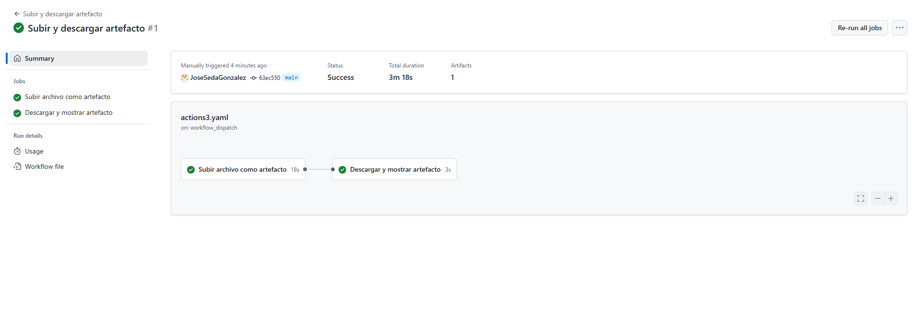

# Actions - Ejercicio 3

## Crear un workflow que suba un archivo existente en el repositorio como un artefacto, y luego lo descargue y muestre su contenido en una tarea posterior

````yml
# Nombre del workflow que aparecerá en GitHub Actions
name: Subir y descargar artefacto

# Este workflow se ejecuta manualmente desde la interfaz de GitHub
on:
  workflow_dispatch:

jobs:
  # Primer job: sube un archivo como artefacto
  upload-artifact:
    name: Subir archivo como artefacto
    runs-on: labs-runner  # Especifica el runner personalizado

    steps:
      # Paso 1: Clona el repositorio para tener acceso a los archivos
      - name: Checkout del repositorio
        uses: actions/checkout@v3

      # Paso 2: Verifica que el archivo a subir existe y muestra detalles
      - name: Verificar archivo a subir
        run: ls -l archivo_automático.txt

      # Paso 3: Sube el archivo como artefacto nombrado "demo-artifact"
      - name: Subir archivo como artefacto
        uses: actions/upload-artifact@v4
        with:
          name: demo-artifact  # Nombre del artefacto
          path: archivo_automático.txt  # Ruta del archivo a subir

  # Segundo job: descarga el artefacto y muestra su contenido
  download-artifact:
    name: Descargar y mostrar artefacto
    needs: upload-artifact  # Solo se ejecuta si el job anterior tuvo éxito
    runs-on: ubuntu-latest  # Usa el runner por defecto de GitHub

    steps:
      # Paso 1: Descarga el artefacto previamente subido
      - name: Descargar artefacto
        uses: actions/download-artifact@v4
        with:
          name: demo-artifact  # Debe coincidir con el nombre definido arriba

      # Paso 2: Muestra el contenido del archivo descargado
      - name: Mostrar contenido del archivo
        run: cat archivo_automático.txt

````
<br>