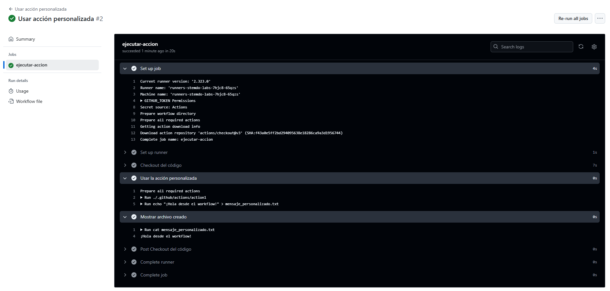

# Actions - Ejercicio 1

## Crear una action personalizada que sea capaz de crear un archivo de texto en el directorio raíz del repositorio con un mensaje

Primero debemos crear un una carpeta actions dentro de la carpeta `.github` y dentro de el action1 un archivo que se llama `action.yaml` que tiene el siguiente contenido:<br>
````yml
name: Crear archivo de texto
description: Crea un archivo de texto con un mensaje dado
inputs:
  mensaje:
    description: "Mensaje que se va a guardar en el archivo"
    required: true
    default: "Mensaje por defecto"

runs:
  using: "composite"
  steps:
    - name: Crear archivo
      run: echo "${{ inputs.mensaje }}" > mensaje_personalizado.txt
      shell: bash
````
<br>Y despues en la carpeta workflows debe crear un archivo que ya haga refencia al archivo anteriormente creado:<br>
````yml
name: Usar acción personalizada

on:
  workflow_dispatch:
    inputs:
      mensaje:
        description: "Mensaje que se pasará a la acción"
        required: true
        default: "¡Hola desde el workflow!"

jobs:
  ejecutar-accion:
    runs-on: labs-runner
    steps:
      - name: Checkout del código
        uses: actions/checkout@v3

      - name: Usar la acción personalizada
        uses: ./.github/actions/action1
        with:
          mensaje: ${{ github.event.inputs.mensaje }}

      - name: Mostrar archivo creado
        run: cat mensaje_personalizado.txt
````
<br>