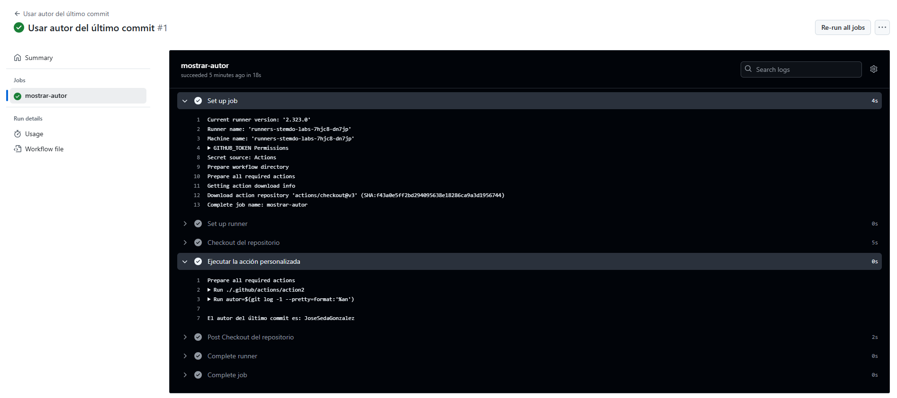

# Actions - Ejercicio 2

## Crear una custom action usando composite actions que imprime el nombre del autor del último commit en los logs del workflow

Primero debemos crear un una carpeta actions dentro de la carpeta `.github` y dentro de el action2 un archivo que se llama `action.yaml` que tiene el siguiente contenido:<br>
````yml
name: Mostrar autor del último commit
description: Imprime el nombre del autor del último commit en los logs
runs:
  using: "composite"
  steps:
    - name: Obtener y mostrar autor del último commit
      run: |
        autor=$(git log -1 --pretty=format:'%an')
        echo "El autor del último commit es: $autor"
      shell: bash
````
<br>Y despues en la carpeta workflows debe crear un archivo que ya haga refencia al archivo anteriormente creado:<br>
````yml
name: Usar autor del último commit

on:
  workflow_dispatch:

jobs:
  mostrar-autor:
    runs-on: labs-runner

    steps:
      - name: Checkout del repositorio
        uses: actions/checkout@v3

      - name: Ejecutar la acción personalizada
        uses: ./.github/actions/action2
````
<br>