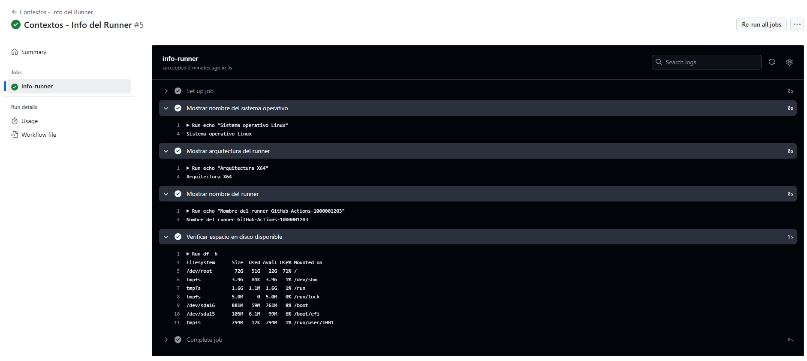

# Contexts - Ejercicio 1

## Configura un workflow que imprima información sobre el runner en el que se está ejecutando el job, como el nombre del sistema operativo, la arquitectura, y el espacio en disco disponible

````yml
# Nombre del workflow que aparecerá en la interfaz de GitHub Actions
name: Contextos - Info del Runner

# Evento que dispara el workflow manualmente desde GitHub
on:
  workflow_dispatch:

jobs:
  # Definimos un job llamado 'info-runner'
  info-runner:
    # Especificamos que este job se ejecute en una máquina virtual con Ubuntu
    runs-on: ubuntu-latest

    steps:
      # Primer paso: muestra el nombre del sistema operativo donde se ejecuta el runner
      - name: Mostrar nombre del sistema operativo
        run: echo "Sistema operativo ${{ runner.os }}"

      # Segundo paso: muestra la arquitectura del sistema (por ejemplo: X86_64)
      - name: Mostrar arquitectura del runner
        run: echo "Arquitectura ${{ runner.arch }}"

      # Tercer paso: muestra el nombre del runner (puede ser útil para runners auto hospedados)
      - name: Mostrar nombre del runner
        run: echo "Nombre del runner ${{ runner.name }}"

      # Cuarto paso: usa el comando 'df -h' para ver cuánto espacio en disco hay disponible
      - name: Verificar espacio en disco disponible
        run: df -h
````
<br>