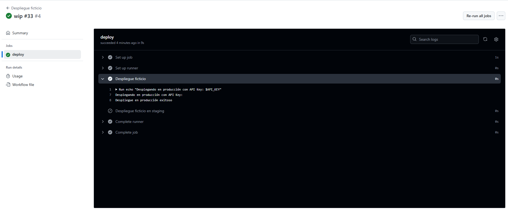

# Contexts - Ejercicio 2

## Configura un workflow que utilice un secreto llamado PROD_API_KEY para realizar un despliegue ficticio si se ejecuta en la rama main, y otro secreto llamado STAGING_API_KEY para cualquier otra rama

**El workflow debería:**

- Utilizar el contexto secrets para inyectar la API Key correspondiente en un comando de despliegue ficticio.
- Imprimir un mensaje indicando cuál API Key se utilizó.

````yml
name: Despliegue ficticio

on:
  push:
    branches:
      - main
      - '*'

jobs:
  deploy:
    runs-on: labs-runner
    steps:
      - name: Despliegue ficticio
        if: github.ref == 'refs/heads/main'
        env:
          API_KEY: ${{ secrets.PROD_API_KEY }}
        run: |
          echo "Desplegando en producción con API Key: $API_KEY"
          echo "Despliegue en producción exitoso"

      - name: Despliegue ficticio en staging
        if: github.ref != 'refs/heads/main'
        env:
          API_KEY: ${{ secrets.STAGING_API_KEY }}
        run: |
          echo "Desplegando en staging con API Key: $API_KEY"
          echo "Despliegue en staging exitoso"
    # Debemos reemplazar las API_KEYS con los nombres reales de
    # los secretos configurados para el repositorio en GitHub
````
<br>