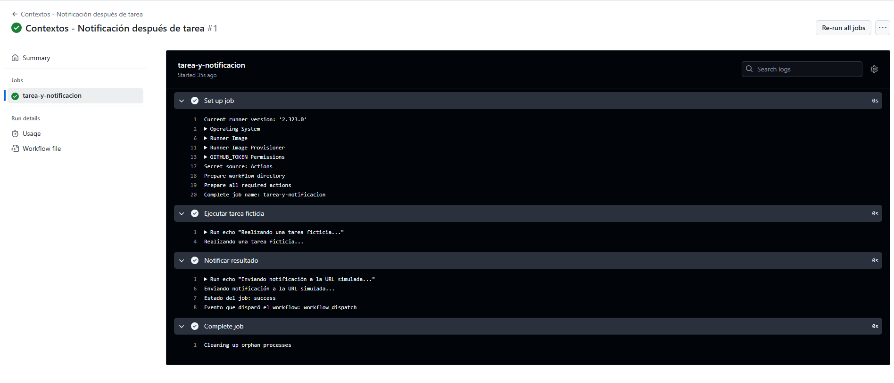

# Contexts - Ejercicio 3

## Configura un workflow que realice una tarea ficticia y luego envíe un mensaje de notificación a una URL (simulada con echo) usando el estado del job y el nombre del evento que lo desencadenó

````yml
# Nombre del workflow que aparece en la pestaña de Actions de GitHub
name: Contextos - Notificación después de tarea

# Evento que dispara el workflow (en este caso, manualmente desde la interfaz de GitHub)
on:
  workflow_dispatch:

# Definición de los trabajos (jobs) del workflow
jobs:
  tarea-y-notificacion:  # Nombre del job
    runs-on: ubuntu-latest  # Tipo de runner que ejecutará el job

    steps:  # Lista de pasos que ejecutará este job

      # Paso 1: Ejecutar una tarea ficticia
      - name: Ejecutar tarea ficticia
        run: echo "Realizando una tarea ficticia..."

      # Paso 2: Enviar una notificación simulada con echo
      # Se usa "if: always()" para que este paso se ejecute siempre,
      # sin importar si el paso anterior falló o tuvo éxito
      - name: Notificar resultado
        if: always()
        run: |
          # Simulación de envío de notificación a una URL
          echo "Enviando notificación a la URL simulada..."

          # Se imprime el estado del job: success, failure, etc.
          echo "Estado del job: ${{ job.status }}"

          # Se imprime el nombre del evento que disparó el workflow
          echo "Evento que disparó el workflow: ${{ github.event_name }}"

````
<br>