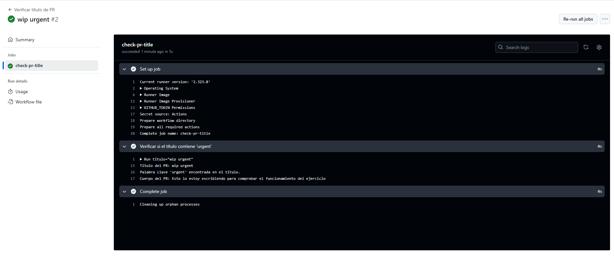

# Contexts - Ejercicio 4

## Configura un workflow que se ejecute cuando se abra una pull_request. El workflow debería verificar si el título del pull request contiene una palabra clave específica (urgent). Si la palabra se encuentra en el título, imprime el título y cuerpo de la PR, si la palabra no se encuentra en el título, haz que la ejecución falle.

````yml
# Nombre del workflow
name: Verificar título de PR

# Evento que dispara el workflow: cuando se abre un pull_request
on:
  pull_request:
    types: [opened]

jobs:
  check-pr-title:
    # Especificamos el sistema operativo del runner
    runs-on: ubuntu-latest

    steps:
      # Paso único para verificar el título del PR
      - name: Verificar si el título contiene 'urgent'
      # Guardamos el título y cuerpo del PR en variables
      # Si no la contiene, mostramos un error y hacemos
      # Mostramos el título del PR por consola
      # Comprobamos si el título contiene la palabra 'urgent'
      # Si la contiene, lo indicamos y también mostramos el cuerpo del PR
      # Si no la contiene, mostramos un error y hacemos fallar el job
        run: |
          titulo="${{ github.event.pull_request.title }}"
          cuerpo="${{ github.event.pull_request.body }}"

          echo "Título del PR: $titulo"

          if [[ "$titulo" == *urgent* ]]; then
            echo "Palabra clave 'urgent' encontrada en el título."
            echo "Cuerpo del PR: $cuerpo"
          else
            echo "ERROR: El título del PR no contiene la palabra clave 'urgent'."
            exit 1
````
<br>