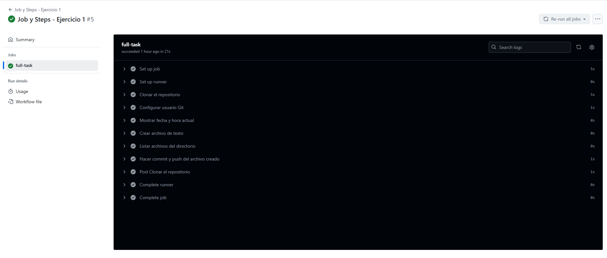

# Jobs y Steps - Ejercicio 1

## Configura un workflow (workflow_dispatch) con un solo job que haga las siguientes tareas:

- Mostrar la fecha y hora actual.
- Crear un archivo de texto.
- Listar los archivos en el directorio actual.
- Hacer un commit y push de cualquier fichero en el repositorio.

````yml
name: Job y Steps - Ejercicio 1

on:
  workflow_dispatch:  # Este workflow se ejecuta manualmente desde la interfaz de GitHub Actions

permissions:
  contents: write  # Concede permisos de escritura al contenido del repositorio, necesario para hacer push si usas GITHUB_TOKEN

jobs:
  full-task:
    runs-on: labs-runner  # El job se ejecutará en el runner personalizado llamado "labs-runner"


    steps:
      - name: Clonar el repositorio
        uses: actions/checkout@v3 # Descarga el contenido del repositorio en el runner para poder modificar archivos

      - name: Configurar usuario Git  # Configura los datos del usuario para que Git pueda hacer commits con esa identidad
        run: |
          git config --global user.name "JoseSedaGonzalez"
          git config --global user.email "jseda@stemdo.io"
          

      - name: Mostrar fecha y hora actual  # Muestra la fecha y hora actual en la consola del workflow
        run: date

      - name: Crear archivo de texto # Crea un archivo de texto que incluye la fecha actual como contenido
        run: echo "Este archivo fue creado automáticamente el $(date)" > archivo_automático.txt

      - name: Listar archivos del directorio # Lista todos los archivos y carpetas del directorio actual para verificar que el archivo se creó correctamente
        run: ls -la

      - name: Hacer commit y push del archivo creado  # Cambia la URL remota para usar un token personalizado con permisos de escritura (MY_PAT)
        # Añade y hace commit del archivo creado, y luego hace push al repositorio remoto
        # Si no hay cambios que commitear, evita que el workflow falle
        run: |
          git remote set-url origin https://x-access-token:${{ secrets.MY_PAT }}@github.com/stemdo-labs/github-actions-exercises-JoseSedaGonzalez.git
          git add archivo_automático.txt
          git commit -m "Add automatic file from workflow" || echo "Nada que commitear"
          git push origin HEAD
````
<src>