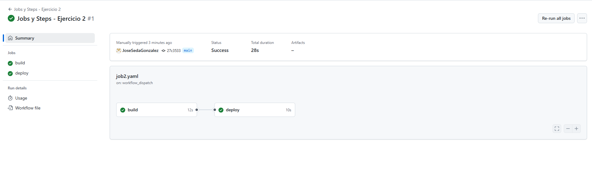

# Jobs y Steps - Ejercicio 2

## 1. Configura dos jobs en un único workflow: "build" y "deploy"
- En el job deploy imprime un mensaje por la consola.
- El job deploy debe depender del éxito del job build.
- Si el job "build" falla, el job "deploy" **no debe ejecutarse.**

````yml
# Nombre del workflow, visible en la pestaña "Actions" de GitHub
name: Jobs y Steps - Ejercicio 2

# Evento que dispara el workflow manualmente desde la interfaz de GitHub
on:
  workflow_dispatch:  # Permite ejecutar el workflow manualmente

jobs:
  # Primer job: build
  build:
    runs-on: labs-runner  # Se ejecuta en un runner personalizado llamado "labs-runner"
    
    steps:
      - name: Simular proceso de build  # Nombre del paso para facilitar la lectura del log
        run: echo "Ejecutando el build..."  # Comando que simula el proceso de compilación

  # Segundo job: deploy
  deploy:
    runs-on: labs-runner  # También se ejecuta en el runner "labs-runner"
    needs: build           # Este job depende del éxito del job "build"

    steps:
      - name: Desplegando aplicación  # Nombre del paso
        run: echo "El despliegue se está realizando tras un build exitoso"  # Mensaje en consola
````
<br>