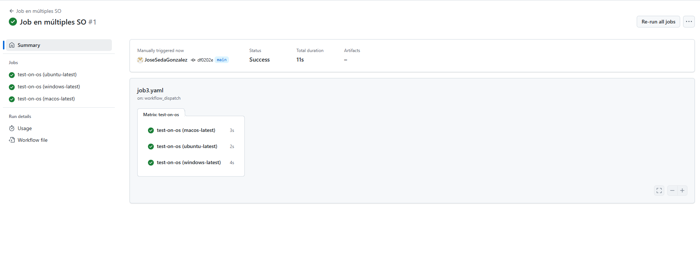

# Jobs y Steps - Ejercicio 3

## Configura un workflow que ejecute el mismo job en diferentes sistemas operativos

````yml
# Nombre del workflow, visible en la interfaz de GitHub Actions
name: Job en múltiples SO

# Evento que dispara el workflow manualmente desde la interfaz de GitHub
on:
  workflow_dispatch:

jobs:
  # Nombre del job
  test-on-os:
    # runs-on será definido dinámicamente con la matriz de sistemas operativos
    runs-on: ${{ matrix.os }}
    
    # Definimos una estrategia con una matriz de ejecución
    strategy:
      matrix:
        # Lista de sistemas operativos donde se ejecutará el mismo job
        os: [ubuntu-latest, windows-latest, macos-latest]

    # Pasos del job que se repetirán en cada sistema operativo
    steps:
      - name: Mostrar información del sistema
        # Comandos que se ejecutarán en cada runner
        run: |
          echo "Sistema operativo: ${{ runner.os }}"
          echo "Nombre del runner: ${{ runner.name }}"
        # Definimos el shell como bash (es compatible también en Windows y macOS dentro de GitHub Actions)
        shell: bash
````
<br>