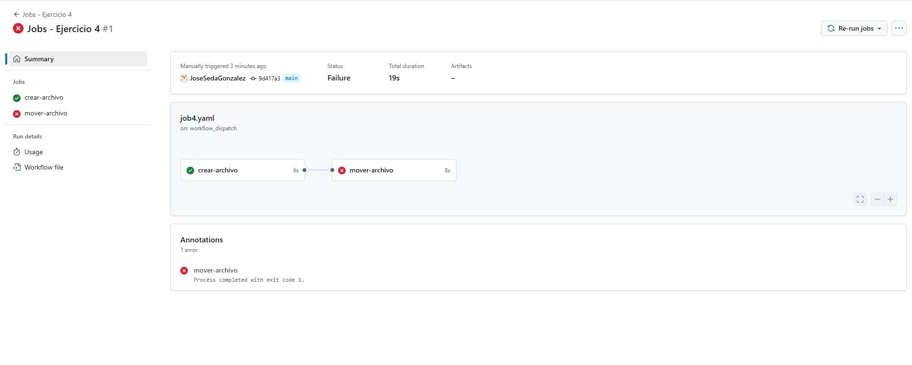

# Jobs - Ejercicio 4

## 1. Crea un job el cual cree un archivo .txt llamado "test"

## 2. Crea otro job que mueva el archivo creado anteriormente a otro directorio. ¿Qué es lo que ocurre?

## ¿Qué ocurre?

Falla porque el archivo se crea localmente en su propio entorno, cuando se ejecuta el segundo job lo hace en un runner limpio que no tiene acceso al sistema de archivos del job anterior por lo que te debria de aparecer un error como este `mv: cannot stat 'test.txt': No such file or directory`.<br>
````yml
# Definimos el nombre del workflow
name: Jobs - Ejercicio 4

# El workflow se ejecuta manualmente mediante el evento 'workflow_dispatch'
on:
  workflow_dispatch:

jobs:
  # Primer job: encargado de crear un archivo de texto
  crear-archivo:
    # Se ejecuta en un runner llamado 'labs-runner'
    runs-on: labs-runner
    steps:
      # Paso para crear un archivo de texto llamado 'test.txt'
      - name: Crear archivo de texto
        run: echo "Este es un archivo de prueba" > test.txt

  # Segundo job: intenta mover el archivo creado por el job anterior
  mover-archivo:
    # También se ejecuta en el mismo tipo de runner
    runs-on: labs-runner
    # Este job depende del anterior, es decir, no se ejecuta hasta que 'crear-archivo' haya terminado
    needs: crear-archivo
    steps:
      # Paso que intenta mover el archivo 'test.txt' a un subdirectorio llamado 'soluciones'
      - name: Intentar mover archivo
        run: mv test.txt ./soluciones
````
<br>