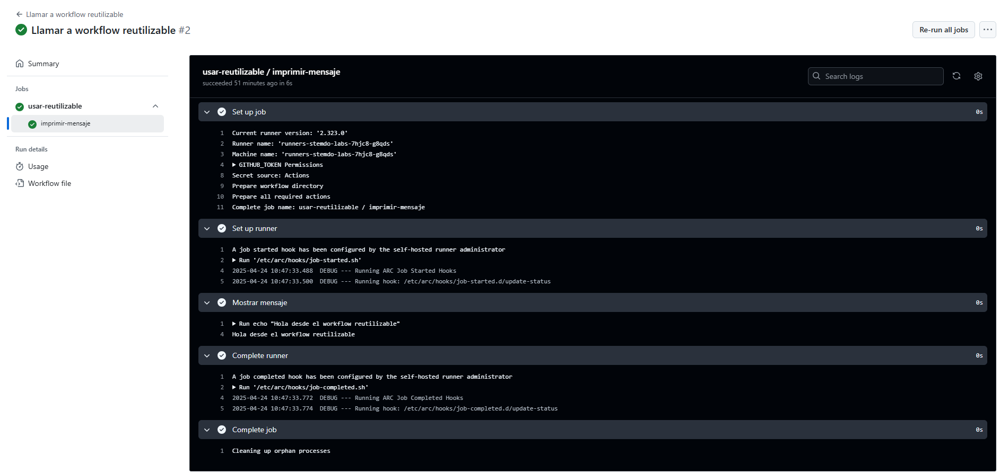

# Workflows reusables - Ejercicio 1

## Configura un workflow reutilizable que simplemente imprima un mensaje

## Luego, crea otro workflow que use ese workflow reutilizable

Tenemos 2 workflows que lo que hacen es que uno utiliza al otro. Este es el contenido de los dos workflows:<br>
````yml
name: Llamar a workflow reutilizable

on:
  workflow_dispatch:  # Permite ejecutar manualmente este workflow

jobs:
  usar-reutilizable:
    uses: ./.github/workflows/reusable1.yml # Ruta al archivo del workflow reutilizable
````
````yml
name: Workflow Reutilizable

on:
  workflow_call:  # Esto permite que otros workflows llamen a este

jobs:
  imprimir-mensaje:
    runs-on: labs-runner
    steps:
      - name: Mostrar mensaje
        run: echo "Hola desde el workflow reutilizable"
````
<br>