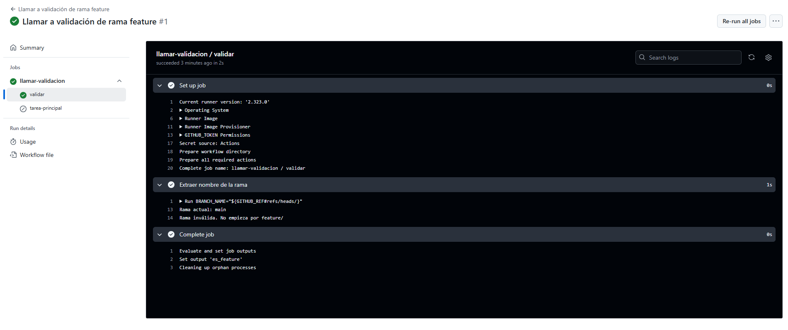

# Workflows reusables - Ejercicio 2

## Configura un workflow reutilizable que primero valide si el nombre de la rama con la que se ejecuta empieza con "feature/". Solo si la validación es exitosa, se ejecutará la tarea principal

````yml
# Nombre del workflow reutilizable
name: Validar rama feature

# Este workflow se ejecuta únicamente cuando es llamado desde otro workflow
on:
  workflow_call:

jobs:
  # Primer job: se encarga de validar si la rama comienza con "feature/"
  validar:
    runs-on: ubuntu-latest
    # Exporta un output llamado 'es_feature' desde uno de sus pasos
    outputs:
      es_feature: ${{ steps.rama-valida.outputs.resultado }}

    steps:
      - name: Extraer nombre de la rama
      # Extrae el nombre de la rama eliminando el prefijo "refs/heads/"
      # Valida si la rama comienza con "feature/"
      # Si es válida, define el output como 'true'
      # Si no es válida, define el output como 'false'
        id: rama-valida
        run: |
          BRANCH_NAME="${GITHUB_REF#refs/heads/}"
          echo "Rama actual: $BRANCH_NAME"

          if [[ "$BRANCH_NAME" == feature/* ]]; then
            echo "Rama válida"
            echo "resultado=true" >> $GITHUB_OUTPUT
          else
            echo "Rama inválida. No empieza por feature/"
            echo "resultado=false" >> $GITHUB_OUTPUT
          fi

  # Segundo job: solo se ejecuta si la validación fue exitosa
  tarea-principal:
    runs-on: ubuntu-latest
    # Este job depende del anterior ('validar')
    needs: validar
    # Solo se ejecuta si el output 'es_feature' fue 'true'
    if: needs.validar.outputs.es_feature == 'true'

    steps:
      - name: Ejecutar tarea principal
        run: echo "Ejecutando tarea principal en rama feature/*"

````
<br>