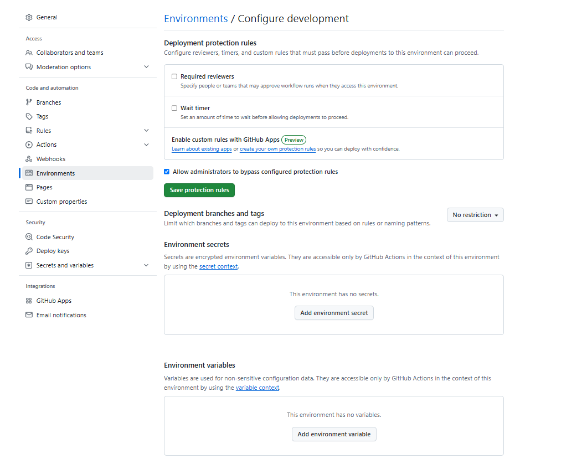
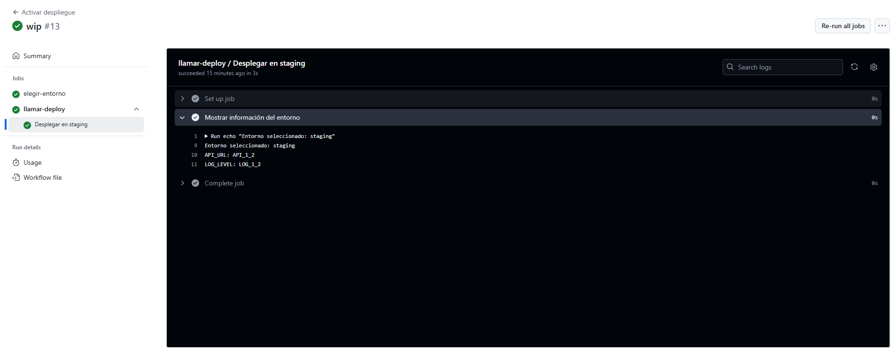
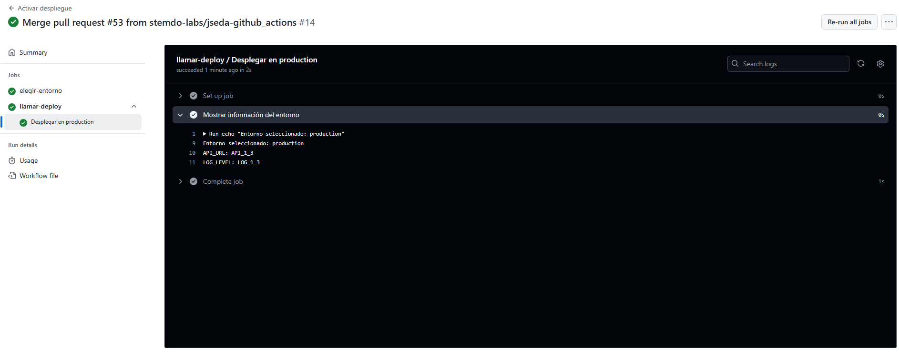

# Workflows reusables - Ejercicio 3

## En este ejercicio, configurarás un workflow reutilizable (deploy-environment.yml) que realizará tareas de despliegue basadas en un entorno específico.

## Este workflow reutilizable será llamado por otro workflow (trigger-deploy.yml) que se ejecutará automáticamente en función de la rama en la que se realice el push o mediante ejecución manual.

Cada entorno (development, staging, production) tendrá configuradas sus propias variables de entorno y secretos en GitHub, los cuales serán utilizados automáticamente por el workflow correspondiente.

Para este ejercicio se utilizarán dos repositorios, uno público, y el repositorio privado en el que se ha estado trabajando.

## Paso a paso:

> 1. Configuración de Environments en GitHub:
>
> - En el repositorio público, ve a Settings > Environments.
> - Crea tres environments: development, staging, y production.
> - Configura variables de entorno específicas para cada environment, como:
>   - API_URL
>   - LOG_LEVEL
> Estas variables de entorno tendrán valores diferentes dependiendo del environment seleccionado.

[Administración de entornos en GitHub](https://docs.github.com/es/actions/managing-workflow-runs-and-deployments/managing-deployments/managing-environments-for-deployment)

> 2. Definir el Workflow Reutilizable:
>
> Crea un archivo llamado deploy-environment.yml en el directorio .github/workflows/.
> Este workflow reutilizable recibirá un input llamado environment, el cual determinará el environment de despliegue.

> 3. Definir el Workflow que Invoca al Reusable:
>
> Crea un archivo llamado trigger-deploy.yml en el directorio .github/workflows/.
> Este workflow se activará en función de las ramas (main, develop, release/*) y llamará al workflow reutilizable para desplegar en el entorno correspondiente.

Lo primero que tenemos que hacer es poner el repositorio en publico en este caso para poder definir varios entornos y en cada uno de ellos definiremos las variables de entorno para luego poder hacer comprobaciones.<br><br>

Después debemos definir un workflow que se va a llamar `deploy_environment.yaml` y otro que se va a llamar `trigger-deploy.yaml` que van a tener la siguente estructura:<br>

````yml
# deploy_environment.yaml
# Nombre del workflow reutilizable
name: Despliegue por entorno

# Este workflow será invocado desde otro workflow mediante 'workflow_call'
on:
  workflow_call:
    inputs:
      # Se espera un input llamado 'environment', obligatorio y de tipo string
      environment:
        required: true
        type: string

jobs:
  deploy:
    # Nombre del job, incluye dinámicamente el nombre del entorno recibido
    name: Desplegar en ${{ inputs.environment }}
    
    # El job se ejecutará en una máquina virtual con Ubuntu
    runs-on: ubuntu-latest

    # Asocia este job con un entorno de despliegue configurado en GitHub (development, staging, production)
    environment: ${{ inputs.environment }}

    # Define variables de entorno específicas para este job
    env:
      # Estas variables son tomadas de los "Environment Variables" configurados en GitHub
      API_URL: ${{ vars.API_URL }}
      LOG_LEVEL: ${{ vars.LOG_LEVEL }}

    steps:
      # Paso único: imprime en la consola los valores del entorno y las variables
      - name: Mostrar información del entorno
        run: |
          echo "Entorno seleccionado: ${{ inputs.environment }}"
          echo "API_URL: $API_URL"
          echo "LOG_LEVEL: $LOG_LEVEL"
````
````yml
# trigger-deployment.yaml
# Nombre del flujo de trabajo
name: Activar despliegue

# Este flujo se ejecuta cuando:
on:
  push: # Se hace push en alguna de estas ramas
    branches:
      - main                # Rama principal → entorno producción
      - dev                 # Rama de desarrollo → entorno development
      - jseda-github_actions # Rama intermedia → entorno staging
  workflow_dispatch:        # También puede activarse manualmente desde GitHub

jobs:
  # Primer job: elegir el entorno adecuado según la rama
  elegir-entorno:
    runs-on: ubuntu-latest  # Se ejecuta en un runner con Ubuntu

    outputs: # Se define una salida llamada 'entorno' para usarla en otros jobs
      entorno: ${{ steps.set-env.outputs.entorno }}

    steps:
    # Extrae el nombre de la rama desde la referencia
    # Asigna el entorno según la rama
    # Si la rama no es válida para despliegue, se aborta el workflow

      - name: Determinar entorno basado en la rama
        id: set-env
        run: |
          BRANCH="${GITHUB_REF#refs/heads/}"
          echo "Rama detectada: $BRANCH"

          if [[ "$BRANCH" == "main" ]]; then
            echo "entorno=production" >> $GITHUB_OUTPUT
          elif [[ "$BRANCH" == "dev" ]]; then
            echo "entorno=development" >> $GITHUB_OUTPUT
          elif [[ "$BRANCH" == "jseda-github_actions" ]]; then
            echo "entorno=staging" >> $GITHUB_OUTPUT
          else
            echo "Rama no válida para despliegue"
            exit 1
          fi

  # Segundo job: llamar al workflow de despliegue pasando el entorno como parámetro
  llamar-deploy:
    needs: elegir-entorno  # Este job depende de que el anterior termine correctamente
    uses: ./.github/workflows/deploy_environment.yaml # Usa un workflow reutilizable
    with:
      environment: ${{ needs.elegir-entorno.outputs.entorno }} # Pasa el entorno detectado
````
<br>Y ahora mostraré un par de capturas para ver la diferencias de la información de los entornos de dicha rama.<br><br>