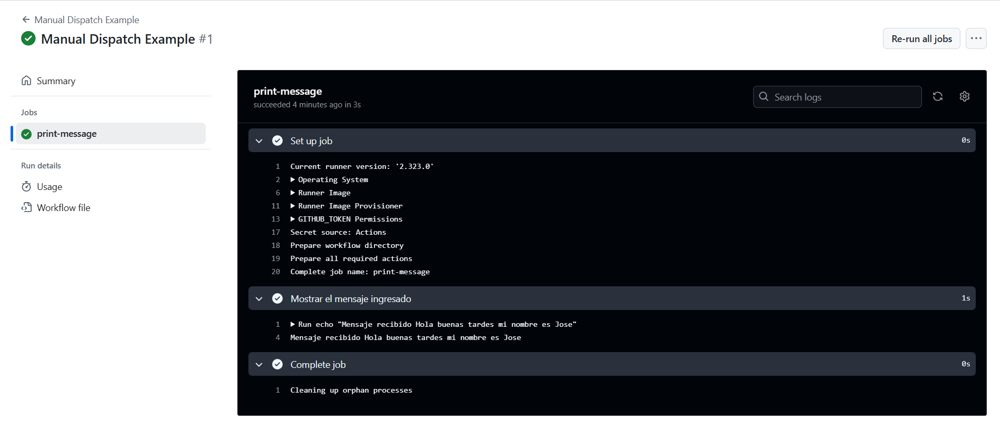

# Triggers (Dispatch) - Ejercicio 

## 1. Configura un workflow para que se ejecute manualmente usando el evento workflow_dispatch.

## 2. Define un input llamado _"message"_ que permita al usuario ingresar un mensaje personalizado.

## 3. El workflow debe ser capaz de imprimir ese mensaje.

````yml
# .github/workflows/manual_dispatch.yml
# Este archivo define un workflow de GitHub Actions que se puede ejecutar manualmente desde la interfaz de GitHub.

name: Manual Dispatch Example  # Nombre del workflow que aparecerá en la pestaña "Actions"

on:
  workflow_dispatch:  # Evento que permite ejecutar el workflow manualmente
    inputs:  # Sección donde se definen los parámetros (inputs) que el usuario puede introducir al lanzar el workflow
      message:
        description: 'Mensaje personalizado para mostrar'  # Descripción del input que verá el usuario
        required: true  # Este input es obligatorio
        default: '¡Hola desde GitHub Actions!'  # Valor por defecto si el usuario no introduce nada

jobs:
  print-message:  # Nombre del job (conjunto de pasos que se ejecutan)
    runs-on: LABS-RUNNER

    steps:
      - name: Mostrar el mensaje ingresado  # Nombre descriptivo del paso
        run: echo "Mensaje recibido: '${{ github.event.inputs.message }}'"  
        # Ejecuta un comando que imprime el mensaje ingresado por el usuario. 
        # `${{ github.event.inputs.message }}` accede al valor del input definido más arriba.

````
<br>
