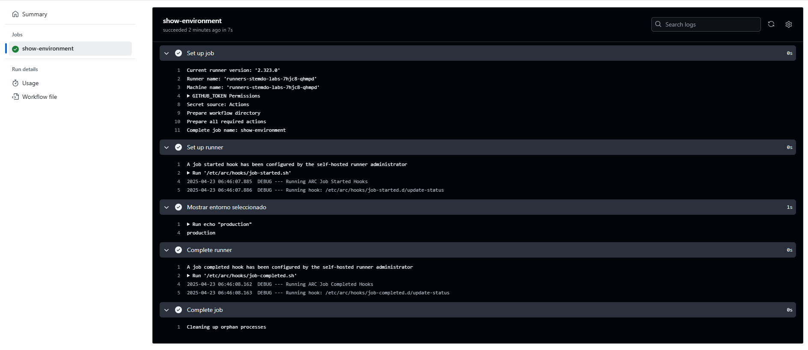

# Triggers (Dispatch) - Ejercicio 2

## 1. Configura un workflow para que se ejecute manualmente usando el evento workflow_dispatch.

## 2. Define un input llamado "_environment_" que permita seleccionar entre "_production_" y "_staging_".

## 3. Imprime el entorno seleccionado en la consola.

````yml
# .github/workflows/select_environment.yml
# Este workflow permite seleccionar manualmente un entorno ('production' o 'staging') y lo imprime en consola.

name: Manual Environment Selector  # Nombre que aparecerá en la pestaña "Actions"

on:
  workflow_dispatch:  # Activa la ejecución manual desde GitHub
    inputs:
      environment:  # Define un input que el usuario debe seleccionar al ejecutar el workflow
        description: 'Selecciona el entorno'  # Descripción visible en el formulario
        required: true  # Este campo es obligatorio
        type: choice  # Especifica que el input será un desplegable
        options:
          - production  # Opción 1
          - staging     # Opción 2
        default: staging  # Valor por defecto si no se selecciona nada

jobs:
  show-environment:  # Job que contiene los pasos a ejecutar
    runs-on: labs-runner  # Runner personalizado, asegúrate de que esté disponible y registrado

    steps:
      - name: Mostrar entorno seleccionado  # Paso que imprime el valor del input
        run: echo "${{ github.event.inputs.environment }}"
        # Imprime en consola el valor que seleccionó el usuario (production o staging)

````
<br>