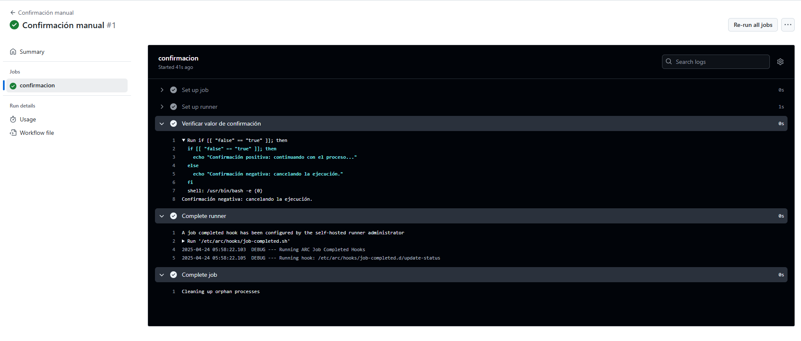

# Triggers (Dispatch) - Ejercicio 2

## 1. Configura un workflow para que se ejecute manualmente usando el evento workflow_dispatch.

## 2. Define un input llamado _"confirm"_ que requiera una _confirmación_ ("true" o "false").

## 3. Imprime un mensaje, dependiendo de si la confirmación es positiva o negativa.

````yml
# Nombre del workflow que aparecerá en la pestaña de Actions de GitHub
name: Confirmación manual

# 1. Este workflow se ejecuta de forma manual gracias al evento workflow_dispatch
on:
  workflow_dispatch:
    inputs:
      # Se define un input llamado "confirm"
      confirm:
        description: "¿Deseas continuar? Escribe true o false"  # Mensaje que verá el usuario al ejecutar el workflow
        required: true      # El input es obligatorio
        default: "false"    # Valor predeterminado si no se introduce nada

jobs:
  confirmacion:
    # Se especifica el entorno en el que se ejecutará el trabajo
    runs-on: labs-runner

    steps:
      # Paso que evalúa el valor del input de confirmación
      - name: Verificar valor de confirmación
        run: |
          # Se comprueba si el valor del input es "true"
          if [[ "${{ github.event.inputs.confirm }}" == "true" ]]; then
            echo "Confirmación positiva: continuando con el proceso..."
          else
            echo "Confirmación negativa: cancelando la ejecución."
          fi
````
<br>