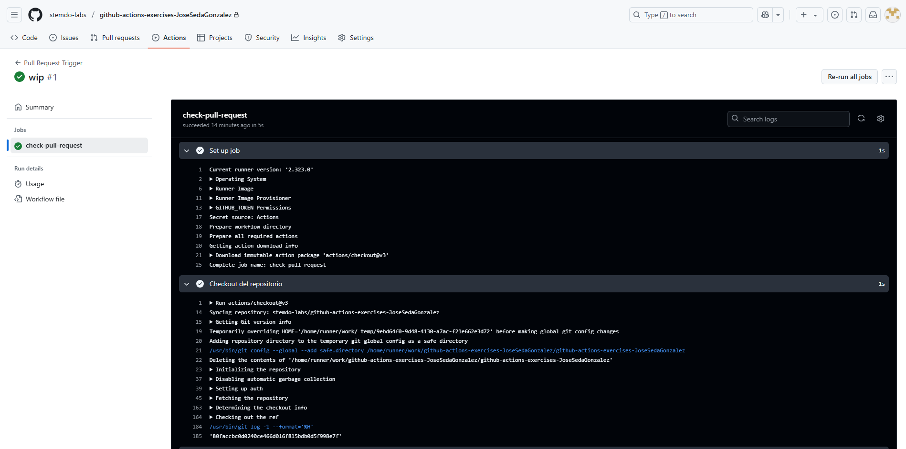

# Triggers - Ejercicio 1

## Configura un workflow para que se ejecute cuando se abre un Pull Request

````yml
name: Pull Request Trigger
# Nombre que tendrá el workflow cuando se muestre en la pestaña "Actions" de GitHub.

on:
  pull_request:
    types: [opened]  # Este workflow se ejecuta únicamente cuando se abre (opened) un Pull Request.
    # Otros tipos disponibles incluyen: synchronize, reopened, closed, etc.

jobs:
  check-pull-request:
    # Nombre del job (puede tener cualquier nombre).
    runs-on: labs-runner
    # Define el runner donde se ejecuta este job.
    # Aquí se usa un runner personalizado llamado 'labs-runner' (por ejemplo, uno auto-hospedado).

    steps:
      - name: Checkout del repositorio
        uses: actions/checkout@v3
        # Paso para clonar el contenido del repositorio dentro del runner.
        # Es necesario si se quiere acceder al código fuente en los siguientes pasos.

      - name: Mostrar mensaje
        run: echo "Pull Request abierto correctamente"
        # Paso que simplemente imprime un mensaje en la consola del workflow.
        # Útil como test inicial para confirmar que el trigger funciona correctamente.

````
<br>