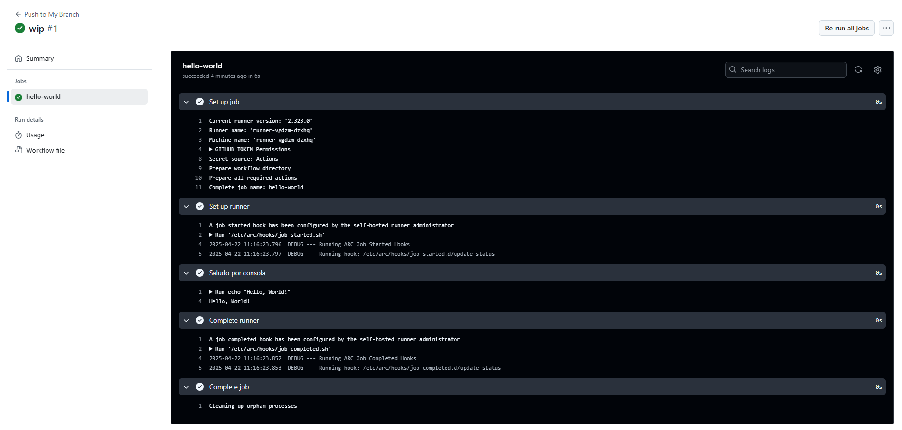

# Triggers - Ejercicio 2

## Configura un workflow para que se ejecute cuando se haga un push en la rama develop y simplemente imprima "Hello, World!" en la consola

````yml
# .github/workflows/push_develop.yml

name: Push to My Branch
# Este es el nombre que se mostrará en la pestaña "Actions" de tu repositorio.

on:
  push:
    branches:
      - jseda-github_actions  # El workflow se ejecuta solo si el push ocurre en esta rama específica.

jobs:
  hello-world:
    runs-on: labs-runner
    # Aquí estás usando un runner personalizado llamado "labs-runner".
    # Asegúrate de que ese runner esté correctamente configurado y disponible en tu repositorio u organización.

    steps:
      - name: Saludo por consola
        run: echo "Hello, World!"  # Paso que imprime el mensaje en la consola del workflow.

````
<br>