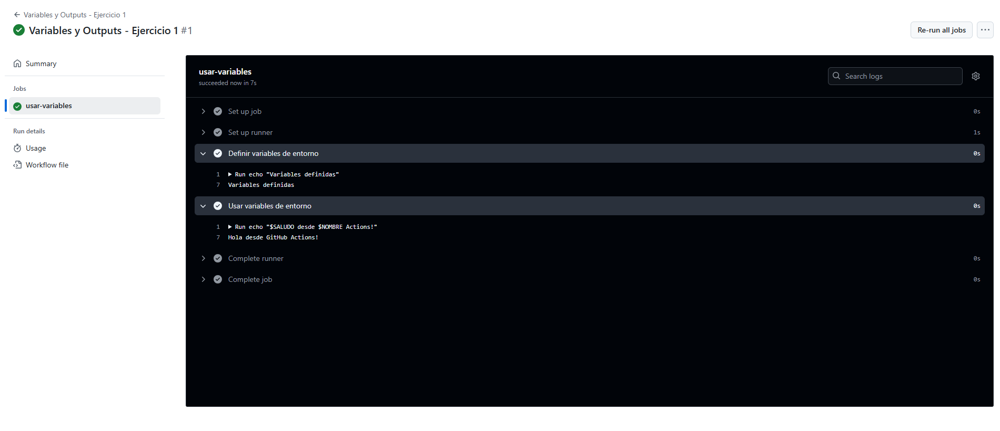

# Variables y Outputs - Ejercicio 1

## Configura un workflow con un solo job que haga las siguientes tareas

- En el primer step, define dos variables de entorno.
- En el segundo step, usa estas variables para ejecutar un comando o script.

````yml
# Nombre del workflow
name: Variables y Outputs - Ejercicio 1

# El workflow se activa manualmente
on:
  workflow_dispatch:

jobs:
  usar-variables:
    # Ejecutamos en el runner definido (por ejemplo, labs-runner o ubuntu-latest)
    runs-on: labs-runner

    steps:
      # Primer paso: definimos dos variables de entorno
      - name: Definir variables de entorno
        run: echo "Variables definidas"
        env:
          NOMBRE: "GitHub"
          SALUDO: "Hola"

      # Segundo paso: usamos las variables definidas anteriormente
      - name: Usar variables de entorno
        run: |
          echo "$SALUDO desde $NOMBRE Actions!"
        env:
          NOMBRE: "GitHub"
          SALUDO: "Hola"

````
<br>