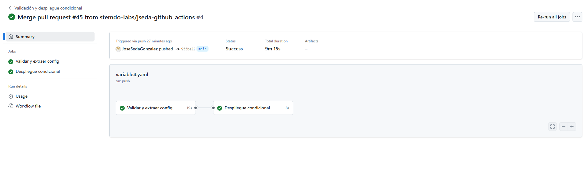

# Variables y Outputs - Ejercicio 4

## Configura un workflow que valide un archivo de configuración (config.json) y realice un despliegue condicional a develop o producción basado en la rama desde la cual se hace el push.

### Pasos:

- Verificar que el archivo config.json exista y que tenga el formato JSON válido.
- Extraer un valor específico del archivo config.json (por ejemplo, la versión de la aplicación) y utilizarlo como un output.
- Si el push se hace en la rama main, el workflow debería simular un despliegue de la aplicación en producción.
- Si el push se hace en una rama develop, el workflow debería simular un despliegue de la aplicación en develop.
- Si el archivo config.json no es válido, el workflow debería fallar y detenerse sin realizar el despliegue.

````yml
# Nombre del workflow
name: Validación y despliegue condicional

# Este workflow se ejecuta cuando hay un push a las ramas 'main' o 'jseda-github_actions'
on:
  push:
    branches:
      - main
      - jseda-github_actions  # Tu rama personalizada

jobs:
  # Primer job: se encarga de validar el archivo config.json y extraer la versión
  validar-config:
    name: Validar y extraer config
    runs-on: labs-runner  # Runner donde se ejecuta el job

    # Definimos un output del job llamado 'version' que se usará en el siguiente job
    outputs:
      version: ${{ steps.extraer.outputs.version }}

    steps:
      # Primer paso: hace checkout del repositorio
      - name: Checkout del repositorio
        uses: actions/checkout@v3

      # Segundo paso: verifica si el archivo config.json existe
      - name: Verificar existencia del archivo config.json
        run: |
          if [ ! -f config.json ]; then
            echo "El archivo config.json no existe"
            exit 1  # Si no existe, termina con error
          fi

      # Tercer paso: valida que el archivo tenga un formato JSON válido usando jq
      - name: Validar formato JSON
        run: |
          cat config.json | jq . > /dev/null || {
            echo "El archivo config.json no es un JSON válido"
            exit 1  # Si es inválido, termina con error
          }

      # Cuarto paso: extrae el valor de la clave "version" del archivo config.json
      - name: Extraer versión del archivo
        id: extraer
        run: |
          version=$(jq -r '.version' config.json)  # Se guarda el valor en una variable
          echo "Versión extraída: $version"
          echo "version=$version" >> $GITHUB_OUTPUT  # Se expone como output del step

  # Segundo job: se encarga del despliegue condicional
  despliegue:
    name: Despliegue condicional
    runs-on: labs-runner
    needs: validar-config  # Este job depende del anterior

    steps:
      # Paso para desplegar en producción, solo si estamos en la rama 'main'
      - name: Desplegar en producción
        if: github.ref == 'refs/heads/main'
        run: |
          echo "Desplegando en PRODUCCIÓN - Versión: ${{ needs.validar-config.outputs.version }}"

      # Paso para desplegar en entorno jseda-github_actions, solo si estamos en esa rama
      - name: Desplegar en entorno jseda-github_actions
        if: github.ref == 'refs/heads/jseda-github_actions'
        run: |
          echo "Desplegando en JSEDA - Versión: ${{ needs.validar-config.outputs.version }}"

````
<br>