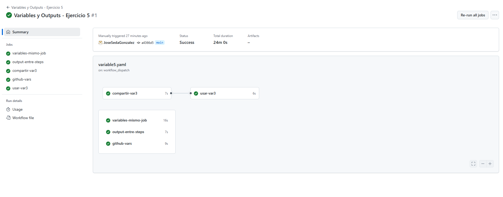

# Ejercicio 5

Variables entre pasos de un mismo job:

- Crea un job que:
  - Defina una variable local ``var1`` con valor 1 y la imprima.
  - Defina una variable ``var2`` usando el entorno de GitHub (``$GITHUB_ENV``) con valor 2.
  - Imprima el valor de ``var2`` en un paso diferente.

---
Compartir variables entre pasos usando outputs:

- Crea un job que:
  - Defina un output ``var_step_output`` con valor "valor".
  - Imprima el valor de ``var_step_output`` en un paso posterior.

---
Compartir variables entre jobs:

- Crea un job que:
  - Imprima el valor de ``var2`` y observa qué sucede.
  - Defina un output ``var3`` con valor 3 para compartir con otros jobs.

---
Imprimir variables entre jobs:

- Crea un job que dependa del anterior y:
  - Imprima el valor de ``var3`` definido en el job anterior.

---
Usar variables predefinidas de GitHub:

- Crea un job que imprima las siguientes variables predefinidas por GitHub:
  - Nombre del ``repositorio``.
  - Nombre de la ``rama``.
  - Nombre del ``evento`` que activó el workflow.

````yml
name: Variables y Outputs - Ejercicio 5

on:
  workflow_dispatch:  # Permite ejecutar este flujo manualmente desde GitHub Actions

jobs:
  # ===========================================================
  # 1. Variables entre pasos del mismo job
  # ===========================================================
  variables-mismo-job:
    runs-on: labs-runner  # Usa el runner definido en el entorno (personalizado)

    steps:
      - name: Definir variable local var1
        run: |
          var1=1
          echo "Valor de var1 (local)  $var1"
        # Esta variable solo vive dentro de este paso. No estará disponible en los siguientes.

      - name: Definir variable persistente var2
        run: |
          echo "var2=2" >> $GITHUB_ENV
        # $GITHUB_ENV permite definir variables de entorno que se conservan en todo el job.

      - name: Imprimir valor de var2
        run: |
          echo "Valor de var2 (persistente entre steps)  $var2"
        # Aquí accedemos a var2 porque fue añadida al entorno global del job.

  # ===========================================================
  # 2. Compartir variables entre pasos usando outputs
  # ===========================================================
  output-entre-steps:
    runs-on: labs-runner

    steps:
      - name: Definir output var_step_output
        id: definir-output  # Este ID permite referirse a los outputs de este step
        run: echo "var_step_output=valor" >> $GITHUB_OUTPUT
        # Guardamos un valor como "output" que podrá ser usado por otros pasos del mismo job.

      - name: Usar output en el mismo job
        run: echo "Valor de output  ${{ steps.definir-output.outputs.var_step_output }}"
        # Aquí accedemos al output definido previamente en el paso 'definir-output'

  # ===========================================================
  # 3. Compartir variables entre jobs
  # ===========================================================
  compartir-var3:
    runs-on: labs-runner
    outputs:
      var3: ${{ steps.set-output.outputs.var3 }}
      # Hacemos disponible var3 para otros jobs

    steps:
      - name: Intentar imprimir var2 (fallará)
        run: echo "Valor de var2  $var2"
        # Esto no funcionará porque $GITHUB_ENV no persiste entre jobs diferentes.

      - name: Definir output var3
        id: set-output
        run: echo "var3=3" >> $GITHUB_OUTPUT
        # Se define un output que sí podrá ser leído por otros jobs

  # ===========================================================
  # 4. Usar variable de otro job (var3)
  # ===========================================================
  usar-var3:
    runs-on: labs-runner
    needs: compartir-var3  # Este job depende del anterior

    steps:
      - name: Imprimir valor recibido de otro job
        run: echo "Valor de var3 desde otro job  ${{ needs.compartir-var3.outputs.var3 }}"
        # Accede al output 'var3' definido en el job 'compartir-var3'

  # ===========================================================
  # 5. Variables predefinidas de GitHub
  # ===========================================================
  github-vars:
    runs-on: labs-runner

    steps:
    # Usuario/repositorio
    # Referencia completa de la rama
    # Tipo de evento (push, pull_request, etc.)
      - name: Mostrar variables predefinidas
        run: |
          echo "Repositorio: ${{ github.repository }}"           
          echo "Rama: ${{ github.ref }}"                         
          echo "Evento que activó el workflow  ${{ github.event_name }}"  
````
<br>
